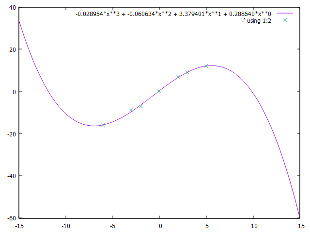

# Least Square Approximation
A source code of report on Least Square Approximation.
## Set of points
| x  | y  |
| -- | -- |
| -6 | 16 |
| -3 | -9 |
| -2 | -7 |
| 0 | 0 |
| 2 | 7 |
| 3 | 9 |
| 5 | 12 |
## Image generated with GNUPlot

